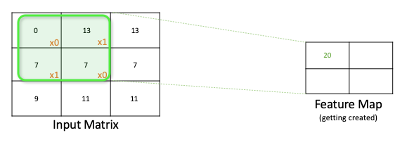

# **EVA5-Assignment-1**

## Group Members:
- Suman Debnath

## **1.	What are Channels and Kernels (according to EVA)?**

## **Answer:**

A `Channel` (also called a Feature Map) is a collection of similar features of all objects of a dataset (for example, it can be all pixels of similar colors, all similar alphabets from a text, or similar patterns from images).

A `Kernel` is a feature and has a 1:1 correspondence with a feature extractor. A set of kernels forms the vocabulary of a domain. For example, the set of all alphabets of the English language, where each alphabet is a Kernel.
 
Let’s take a simple example to illustrate this, we will try to see how we can get a `feature map(Channel)`, given an image using a kernel. As we know every input image is represented by a matrix of pixel values. Apart from the input matrix, we also have another matrix called the filter matrix (as known as `kernel`, or simply a filter, as we defined above). 

We take the `filter matrix`, slide it over the input matrix by one pixel, perform element-wise multiplication, sum up the results, and produce a single number. 

Next, we slide the filter over the input matrix by one pixel and perform the same steps, and update the feature map

Similarly, we continue to perform the same, 

 
And finally, we complete sliding the kernel over the entire input matrix by one pixel, performing element-wise multiplication and summing their results, which creates a new matrix and this matrix is called a `channel` or `feature map` or activation map. And this whole operation we call, as the `convolution operation`.

## **2.	Why should we (nearly) always use 3x3 kernels?**

## **Answer:**

The most basic reason is that any higher-order odd-sized convolution can be realized by successive application of 3x3 kernels. A 3x3 kernel is thus the most elementary sized kernel. But there are a few more reasons:

- `Receptive Field`: A small kernel (like a 3x3) will have a smaller receptive field which means it will look at very few pixels at once whereas a large kernel (like a 5x5) will look at a larger field view. This in turn would mean that the features extracted by a small kernel would be highly local whereas the features extracted from the large kernel would be generic and spread across the image.

- `Amount of Information extracted` : Small kernels would extract small complex features whereas the large kernel would extract simpler features. The amount of features extracted by large kernels would be considerably lesser than the small kernels.

- `Network Depth` : Small kernels would lead to slow reduction of image dimensions making the network deep whereas large kernels would decrease the size of the image much faster. Weight sharing is better in small kernels than with a large kernel. For example: Number of weights (parameters) in two 3x3 kernels = 3x3 + 3x3 = 18 whereas the number of weights in an equivalent 5x5 would be 25. Thus, two 3x3 kernels would extract richer information and the network would have lesser parameters.

- `Hardware Optimization` : Most available accelerators, like Nvidia, have optimized implementations for 3x3 convolutions.

`Reference`: [Stackoverflow - Kernal in CNN](https://stackoverflow.com/questions/56320862/1x1-3x3-5x5-kernal-in-convolution-neural-network)
 
## **3.	How many times do we need to perform 3x3 convolutions operations to reach close to 1x1 from 199x199 (type each layer output like 199x199 > 197x197...)**

## **Answer:**

 
## **4.	How are kernels initialized?**

## **Answer:**

A kernel is almost always `randomly` initialized (typically from a Gaussian distribution) and during the process of training, it learns the weights that constitute the kernels. Pre-initialized kernels in shallow layers are used in transfer learning.
 
## **5. What happens during the training of a DNN?**

## **Answer:**

Given an input, all the layer elements effectively constitute a `transformation` of the `input` to a `predicted output`. The measure of variation between the predicted output and the actual output is defined as loss. The value of this loss is then passed backwards through filters at each layer and is used to adjust values in the filters to effectively minimize the difference between predicted and actual output. This way the value of the `filters` are adjusted during training and the system is said to have _converged_ when the loss is _minimized_. Once this state is reached, weights in the filters won't be adjusted by appreciable quantities and the filters represent a `trained` state of the network.
 
The above mechanism helps in detecting progressively higher forms of patterns in images. Kernels/ Filters in shallow layers of a DNN are trained to detect elementary aspects like _Edges, Textures and Patterns_. These are also the layers that need not be re-trained across similar datasets. Deeper layers in the DNN architecture are trained to detect Parts of Object and Whole Object. These layers are closer to understanding objects specific to a dataset.

